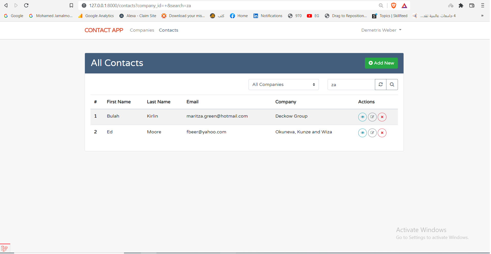

# Contact-App

# Overview
## Contacts app is laravel application that tie users contacts with companies for bussiness purposes.

# Table of contents (pages)

## Project pages

 ## login page

## Register page 

## Email verification after registration page 

## Reset password page 

## dashboard page 

## contacts page 

## contacts filter by company

## creat contact page 
'

## edit contact page 

## show contact details page 

## pagination feature 

## contact form validation feature 

## logout functionality 

## profile page 

## search feature (contacts / companies) 

## create company

## show company details page 

## edit company page 

## delete company 

## company form validation feature 

